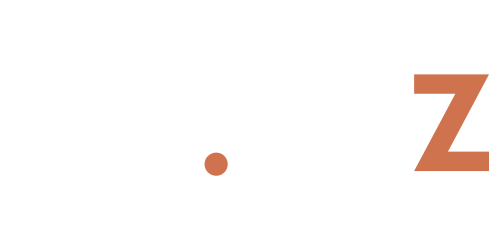
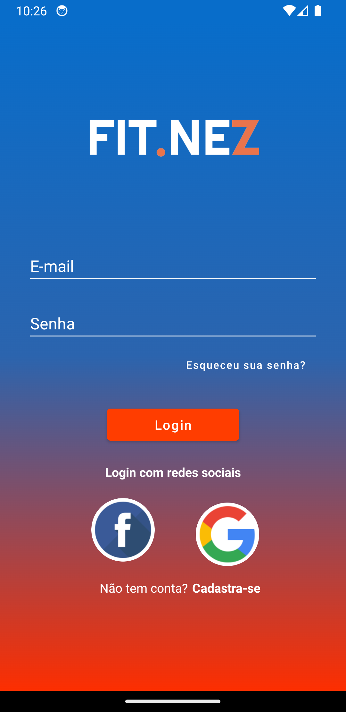
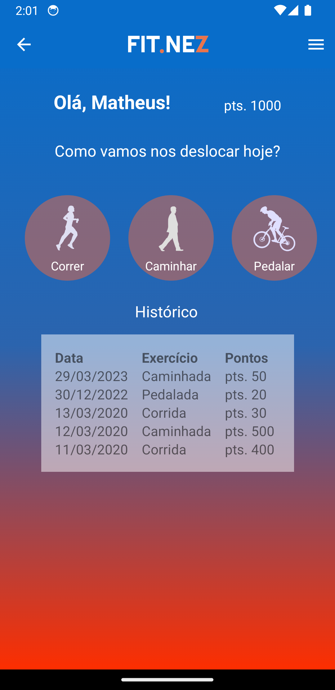

<div align="center">
    
</div>

<p align="center">
  <a href="#-technologies">Technologies</a>&nbsp;&nbsp;&nbsp;|&nbsp;&nbsp;&nbsp;
  <a href="#-getting-started">Getting started</a>&nbsp;&nbsp;&nbsp;|&nbsp;&nbsp;&nbsp;
  <a href="#-project">Project</a>&nbsp;&nbsp;&nbsp;|&nbsp;&nbsp;&nbsp;
  <a href="#-layout">Layout</a>&nbsp;&nbsp;&nbsp;|&nbsp;&nbsp;&nbsp;
  <a href="#-license">License</a>
</p>

<br>

---

## 🧪 Technologies

This project was developed using the following technologies:

-   [Android](https://www.android.com/intl/pt-BR_br/)
-   [Kotlin](https://kotlinlang.org/)

## 🚀 Getting started

Clone the project and access the folder

```bash
$ git clone https://github.com/victortxc/FIAP-ESG-ANDROID.git && cd FIAP-ESG-ANDROID
```

Follow the steps below

```bash
# Start the project
$ Run an Android simulator
$ Run the project via Android Studio
```

## 💻 Project

App to motivate physcal activities to collaborators that work from home

## 🔖 Layout

<div align="center">
    
    
</div>

## 📝 License

This project is licensed under the MIT License. See the [LICENSE](LICENSE.md) file for details.
